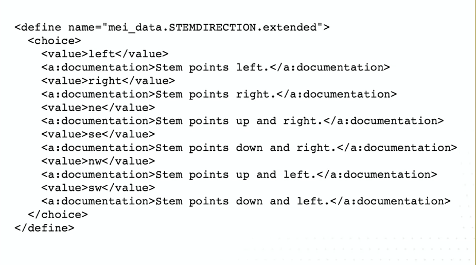
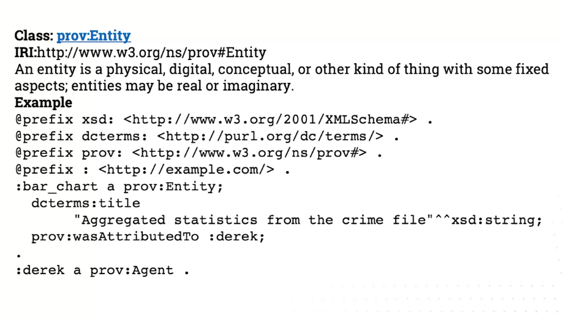
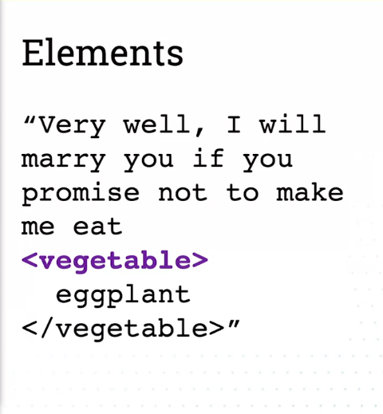
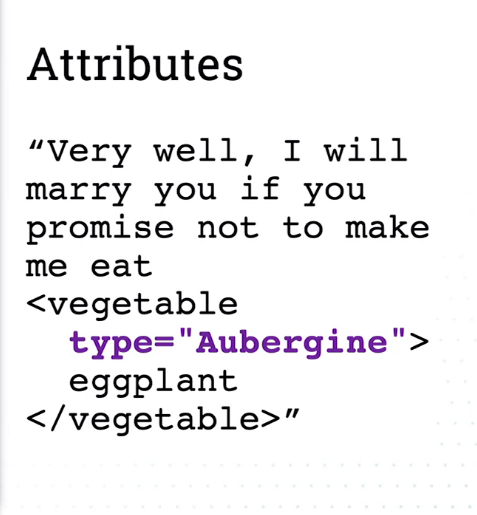
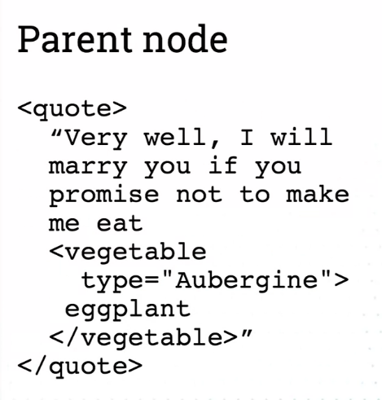
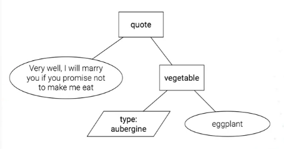

# Semantic Databases
The meaning that we have in common can be shared more effectively and we can communicate structures and information between databases

# Semantic databases - What does a table actually tell us

Sharing a Relational database

* Just data
  * CSV
  * A table in a RDB, the data in the table but also the column specification
  * The CSV file is the data but not the relation
* Full relation (data and data types)
  * Database dump (.sql)

Example

SF Movie Locations
* Actor1, Actor2, Actor3
  * Personal name
  * An actor
* Year
  * Year is a positive integer
  * Year is a calendar year
* Location
  * Text
  * Geographical location
    * In San Francisco

### Layers of meaning
* Data type
  * string, integer, float
* Data domain
  * place, person, date
* Data semantics
  * Person acted in film

The more meaning we can specify, the more we're able to spot when someone else is specifying the same meaning.

### Shared meaning
* Share data
  * e.g. a .csv file
* Share difinitions
  * Data entry documentation
* share syntax
  * Validate new data. Agreements how we'll encode our information so new entries are accepted
* Share machine-readable semantics

### Deductive database
First order logic:

`ancestor(c, a) <- parent(c, a)`

`ancestor(c, a) <- parent(c, b) AND ancestor(b, a)`

`sibling(a, b) <- parent(c, a) AND parent(c, b)`

In this example:

`<-ancestor('Anakin', 'Kylo')`

It won't look for explicit '___ is ancestor of ___' but it will look for the relation.

## Sharing meaning in the real world
### Common semantics
* Shared documents(s)
* Formal specifications
* Human-readable definitions

We always need realiable ways of sharing:
* Information
* Structures and semantics in computer-readable form
* Structures and semantics in a human-readable form

With these three, we can start to communicate and share meaning.

For example, STEM a music notation, tries to convey the last two (computer and human-readable)

A specification document in human-readable form:

## XML - Documents with semantics
eXtensible Markup Language

Example of text that has been marked up:

Atributes

There always needs to be a parent node betcause documents are trees:

