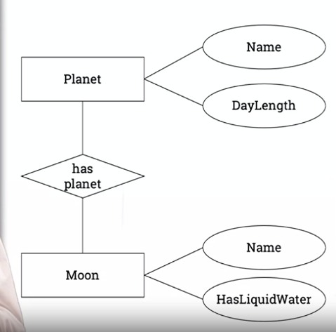
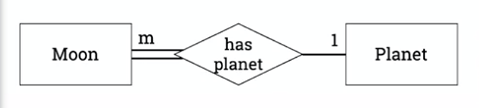

# Introducing Joins

From the previous exercise/challenge.



We'll talk about the __has planet relationship__

## Joining tables
```SQL
SELECT Lead.name,
    Rhythm.name, Bass.name,
    Drums.name
FROM Lean, Rhythm, Bass, Drums;
```
This is called a **Cross Join**

Let's say we have
Lead guitarists: 7
Rhythm Guitarists: 12
Bass guitarists: 8
Drummers: 15

Cross Join: 7 x 12 x 8 x 15 = 10,080 results in the query.

A cross join gets big easily.

```SQL
SELECT Planet.Name,
    Moon.Name, HasLiquidWater
FROM Planet, Moon
WHERE Planet.Name = Moon.hasPlanet
AND DayLength < 11;
```

This is an **Inner Join**. The DBMS will typically detect it's an inner join, instead of a different join, and treat it as such, but it can be explicitly stated as:

```SQL
SELECT Planet.Name,
    Moon.Name, HasLiquidWater
FROM Planet INNER JOIN Moon
ON Planet.Name = Moon.hasPlanet
AND DayLength < 11;
```

Planets: 8
Moons: 173


Cross join: 8 x 173 = 1,384

Inner join: 1 x 173 = 173

**Outer Join**

```SQL
SELECT Planet.Name,
    Moon.Name, HasLiquidWater
FROM Planet LEFT JOIN Moon
ON Planet.Name = Moon.hasPlanet;
```

Planets: 8
Moons: 173

Cross join: 8 x 173 = 1,384
Inner join: 1 x 173 = 173
Outer join: 1 x 173 + 2 (null records for planets which don't  have moons, **no match**)

# Drawing a database II - More about joins

## Cardinality
**1:n**
One row in table x joins with zero, one or more rows in table y
How many rows in one table matches with how many rows in another table.

Cardinality is expressed as a ratio:
* 1:1
* 1:n
* m:n

1:1 cardinality is rare

m:n many to many

Cardinality affects implementation

1:n or n:1



Use a Foreign Key - Place the Primary Key of the tabl with 1 value into the table with n values.

```SQL
CREATE TABLE Moons (
    MoonName CHAR(20),
    PlanetName CHAR(10),
    Diameter INT,
    PRIMARY KEY (MoonName)
);
```
OR add it
```SQL
CREATE TABLE Moons (
    MoonName CHAR(20),
    PlanetName CHAR(10),
    Diameter INT,
    PRIMARY KEY (MoonName),
    FOREIGN KEY
        (Planetname)
        REFERENCE
        Planets(PlanetName)
);
```

1:1


This could be understood as an entity with a property. However, there are reasons not to do it too, implementing it as a 1:n and putting the PK of one of the tables into the other table

```SQL
CREATE TABLE Projects (
    Student VARCHAR(100),
    Title VARCHAR(100),
    Mark INT,
    PRIMARY KEY (Student)
);
```

**m:n**

It's impossible in a relational model unless we change it a little bit.


We add a new entity


A tutor can be inmultiple tutor roles.

A student can be in multiple tutor roles, as a student.

```SQL
CREATE TABLE TutorRole (
    Student VARCHAR(100),
    Tutor VARCHAR(100),
    PRIMARY KEY (Student, Tutor)
)
```

So we need to modify the ER diagram before implementing the DB to accommodate the restrictions of the Relational Model.

# Database integrity and the role of keys
## What could go wrong?

```SQL
MoonName: Deimos
PlanetName: MERS NULL
Area: 495 / -495
```

Knowing what values are valid is important

# Avoiding errors
## Integrity constraints

When we mistype a field, Mers instead of Mars for example.
Join fields must match

Use FOREIGN KEY
INSERT with wrong value will fail

```SQL
FOREIGN KEY
    (PlanetName)
    REFERENCES
    Planets(PlanetName)
```

If we implement this, inserting the wrong PlanetName will make the insertion fail.

## Only some values of a field are valid
For example for positive values
```SQL
Area INT
    CHECK (Area > 0)
```

## Table values should not be inconsistent
We avoid repeating information in a database. We use **PRIMARY KEY** to guarantee uniqueness.

Avoid repeating information in a database.

Avoid storing calculated values.

## Changes should not cause inconsistency
Use foreign key rules to enforce the correct behavior.

```SQL
FOREGN KEY
    (PlanetName)
    REFERENCES
    Planets(PlanetName)
    ONE DELETE CASCADE
```

When parent entry (in planets) is deleted, remove related moons.

## Table values should not be inconsistent
Remove functional dependencies.

