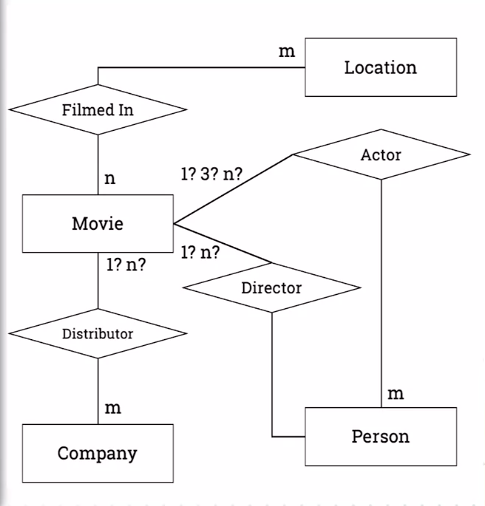
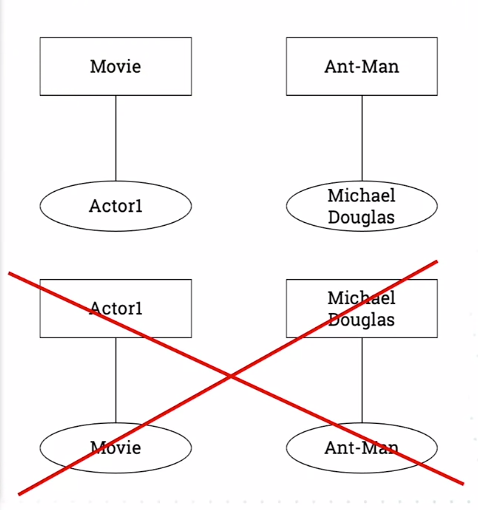
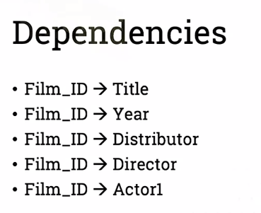
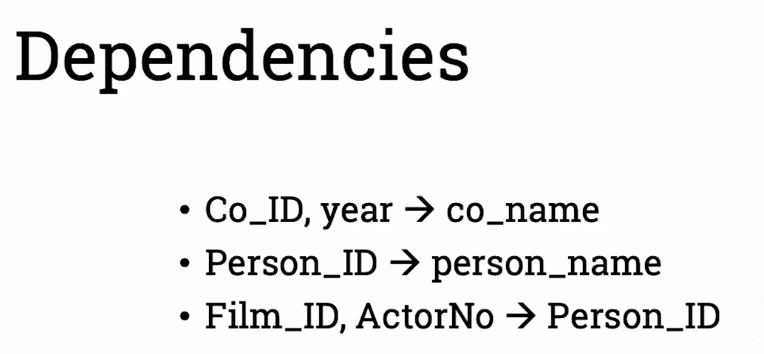
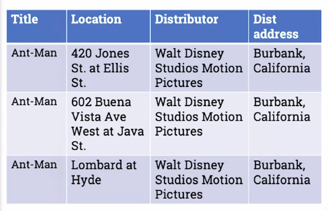
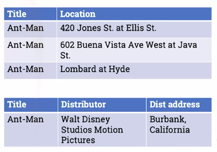
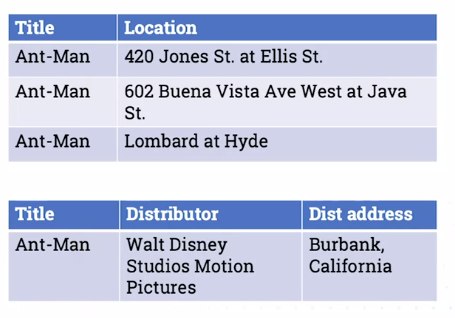
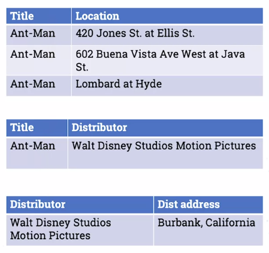
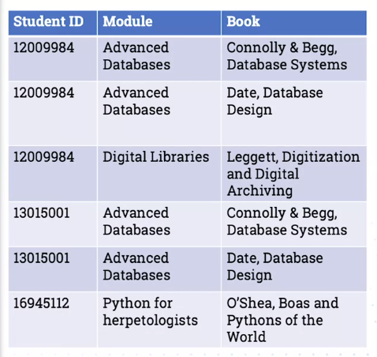

# Sources of error
* Bad data coming in
* Poor application logic
* Failed database operations (outages, network errors, etc.)
* Malicious user activity

## Data Coming in
* Automated integrity checks
* The human factor

## Application logic
* Risk reduction - normalization

## Failed operations
* Saving database state - snapshots
* Blocks of commands - transactions

## User actions
* User privileges and security

#  Integrity and the risk of errors
## Integrity
Specify PRIMARY or UNIQUE KEY
* Ensures every row is identifiable
* Will throw an error if any change will create a duplicate

Specify FOREIGN KEY
* Ensures every reference is maintainable
* Will throw an error if any change will create a reference to a non-existent key
* Will propagate changes to the parent table

SPECIFY CHECK
* Ensures column data is valid

Integrity checks will not check for truth

## Consistency and Abnormalities
The case for normalization

## Non-loss decomposition

A decomposition of a single relation into two or more separate relations such that a join on separate relations reconstructs the original.

## Functional dependency

An attribute is said to be functionally dependent on another attribute X in the same relation if, for any legal value of X, there is exactly one associate value of Y.

Functional dependency works only in one direction
We can see that Michael Douglas as Actor 1 is functionally dependent on Ant-Man (Movie), but Ant-Man is not functionally dependent on Michael Douglas being Actor 1.

Main dependencies

Other dependencies in the example

# Normal forms

## First normal form (1NF)
The table is a relation. All of its attributes are scalar values (no column contains an array or an object).

## Heath's Theorem
A relation with attribute A, B and C with a functional dependency A->B is equal to the join of {A, B} and {A, C}

In other words, if A->B, B can be moved into a look-up table.

## Second normal form (2NF)
The table is in 1NF. Every non-key attribute is **irreducibly** dependent on the primary key (no sub structures)

We move the depencency to a another (look-up) table.

## Transitive dependency

A, B and C are attributes or sets of in a relation, with functional dependencies:

A->B, B->C, A->C
A->C is defined as **transitive**, because it is implied by A->B and B->C

## Third normal form (3NF)

The table is 2NF. Every non-key attribute is non-transitively (directly) dependent on the primary key.

We can see that every time the Distributor Walt Disney comes up, the address will come up repeatedly.

That's why we create another table for it.

## Boyce-Codd normal form (BCNF)

Created after the first 3NF because Codd found it was not quite as tight.

The table is 3NF. All non-trivial functional dependencies depend on a superkey.

## Multi-valued dependency

A and B are two non-overlapping sets of attributes in a relation. There is a multi-valued dependency if the set of values for B depends only on the values of A.

A->>B is similar to a functional dependency, but with multiple options for B.

## FourthnNormal form (4NF)
The table is 3NF. For every multi-valued dependency A->>B, A is a candidate key.

We can see a book is dependent on the module but there are multiple values of Book for one Module.

We can see we created a new table using A (Module) as the primary key.

# Normalisation reduces the risk of anomalies

Mostly by reducing repetition