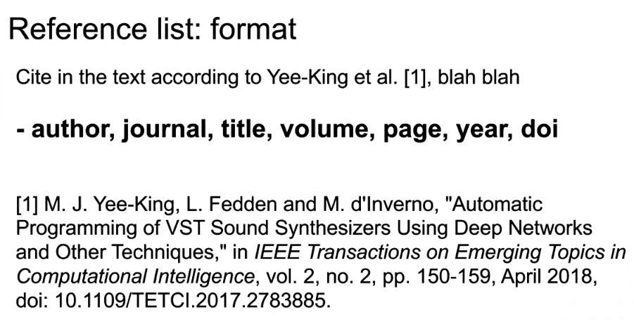
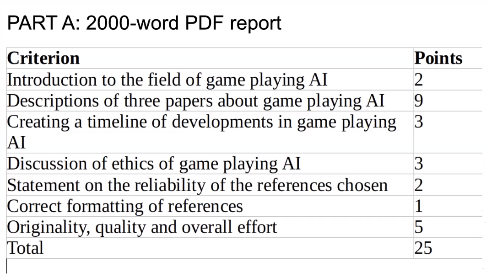
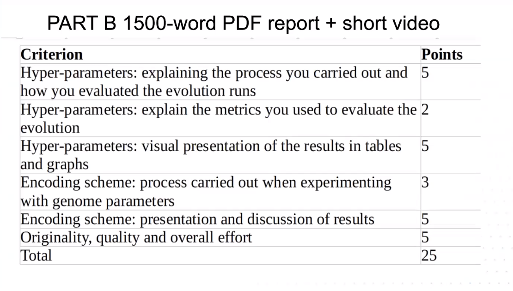

# Mid-term Webinar

## Part A - Reviewing research papers about game playing artificial intelligence systems

2000-word PDf report

### A.A Introduction to the field of game playing AI
* What is it?
* What is it trying to achieve?
* What techniques does it use? (General idea, next sections will go in more depth)

### A.B Descriptions of three papers about game playing AI
* What are the researchers trying to achieve?
* Which techniques did they use to address the problem?
* Which techniques did they use to evaluate their research?
* How successfully do you think they were in achieving their goals?
* Did they provide any source code or open data?

Try finding your own sources, but you can also use the papers mentioned in the lectures.

Don't miss answering any of the questions

Reflect the justification and opinion in the answer, not just mention the evaluation, how you review the results. You can relate the idea to the topic, their results, the implementation, etc.

Avoid conceptual papers, we're looking for a presentation, a reasearch and impelementation that took place. Present and past implementation or experiments are fine too.

Reflect your personal opinion, not just state the facts.

Show your reviewer level, you understood what the authors did and use your own words to explain it. You can critize the paper too. Cite other sources.

Part A is usually bigger than part b

### A.B Create a timeline of developments in game playing AI
This section is about the papers you choose.

Look at the techniques in the papers, map them in a timelines, look into the techniques they mention or use and add them to that timeline. When they introduce technique they will likely have a citation, where the techniques come from.

Text with dates, no need to go crazy.

A gant chart will help, milestones, or a table.

The history of the technology itself, when it started, improvement stages, up to when the paper was created. Only dates won't get full marks.

### A.C Discussion of ethics of game palying AI
* Specifiallly about your chosen papers!
* Did they discuss ethics?
* What is your position here?

Is it fair, damaging?

### A.D Statement on the reliability of the references chosen
* Journal articles (which publisher?) is it reliable?
* Conference papers (which association?)
  *  ACM Transactions
  *  IEEE Transactions
  *  Taylor & Francis / Routledge / CRC Press
  *  Lectures notes on computer science (LNCS)
* Blog posts
* Company websites
* Etc.

Apply critical judgement.
Journals are usually reviewed several times.

Conference papers are not usually that well reviewed, but authors can't submit a revision. However, published conference papers show they have been accepted by the organizations, whose reputation needs to be evaluated.

Blogs, company websites are less reliable. Medium, for example, hosts articles which people try their best in.

In the worst case scenario, you mention 3 reference.

Cite the references within the paper, the context.

Don't be afraid of citing.

Rubric - Part A

## Part B - Experimenting with genetic algorithms and evolved creatures.

1500-word PDF report + short video

Experiment with the creatures study case, the settings in the algorithm, measuring things, being consistent, collecting results of the different conditions that are tried out.

### B.A Hyper-parameter exploration
* Adjust the algorithm parameters - What are the mutation rate, the population size, etc.

* Measure performance - Come up with a measure of performance though systematic means. e.g. What's the average fitness of the population, how quickly did the population fitness change over time. Try different settings, multiple runs, and measure the effect of those settings on the performance of the algorithm.

* Tables and graphs - Present the work in visual vay using tables and graphs. Graphs of thigns getting fitter over time at different speeds, tables summarizing the results of multiple runs with different settings.

Carry out a scientific process, do research and present it in a way that is easy to understand.

### B.B Experiment with the encoding scheme
* This is where you can develope  your own ideas.
* Adjust ranges
* Add other components or possibilities

The list of floating point numbers gets converted into an expansion and a graph wich then becomes the 3D model with controls in its motors, expressing the genome of the system into a simulated creature. The econding scheme is how we get from the numbers to the creature.

Evaluate all the different parameters, what are the available parts to build creatures (pyBullet has a wide array of parts, URDF has a wide array of capabilities which we tried to limit based on the Karl Sims paper). Come up with interesting ideas.

* "I implemented technique 1, 2 and 3 to evaluate the system" while the other is "about highligting which specific metrics you have used", here you link it to the reviews ... implementation, course examples"

It's about the techniques used, not so much about the results but the process, carried out the process, carefully measured the different conditions and described them well, and presented the results of that measurement and the process effectively in graphs.

### B.C Video

Explain in camera or in the computer why we chose that video.
It's not a long video, make it informative, you can explain the content of the video in camera, you can use text on the screen or slides showing parameter values, or techniques implemented, highlighting the most important aspects your implementation. Do your best in adding as much detail as possible.

For example in the genetic encoding you can explain "within this range, the range of outputs, the results of the changes (experimentation)". Show that you went further than the course materials. The quality of the video should explain flaws, advantages, essential parts of your implementation.

Rubric - part B

