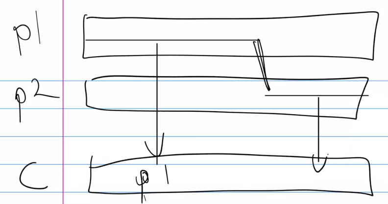

# Fitness function and simulation
* Revisiting the GA, what the process looks like and where we're at in that process.
* Random population, how to generate one.
* Running in simulation, how we run all the individuals in a population inside a simulation.
---
### Measuring distance moved
Implement a fitness function to evaluate how far they have moved.

### Generating a random population
We'll create multiple random genemes and wrap them in a creature class.

### Running in simulation
* We'll create a new class for the Simulation.
* Set up a pybullet environment in DIRECT mode, not using the GUI, which runs faster.
* Create (intantiate) an individual inside the simulation (phenome) as we have been doing before
* Step through time, running the simulation as quickly as possible and update the motors as we go so the creature moves as it should.
* End the simulation

### Measuring distance moved
* Position at the start of simulation
* Position at the end of simulation

## Running creatures in simulation
* New module
* run_create funciton
* update_motors function
* Updating creature position

### Build the simulation class
* new module
* set up a pybullet environment in DIRECT mode
* take account of physicsClientId in all pybullet calls
* runCreature
* multi-process version

### run_creature
* resetSimulation
* setGravity
* write creature to XML and load it back in
* stepSimulation
* after steps iterations, exit
* Creature.update_position

## Implement the fitness function
### What to measure?
We'll just use distance travelled.
### Compute distance travelled
The euclidian distance between a and b.

`np.linalg.norm(a-b)`

### Evaluate population
Test to evaluate a population of random creatures

### The Flying-into-the-air problem
Some creatures get an unfair advantage when they are crated with the floor inside. We set the position to [0, 0, 3], 3 units above ground

### Other things we might consider
* Energy use
* Competing with other creatures

## Multi-process evaluation
### Motivation
Running a GA is slow. Let's make it multi-processor capable

Steps:
1. Prepare the simulation class by making the urdf file be crated dynamically
```python
 xml_file = 'temp' + str(self.sim_id) + '.urdf'
```
2. create a ThreadedSim class
* Constructor creates multiple Simulations with ids
* Statis function to run a creature in a simulation and return the result

```python
class ThreadedSim():
    def __init__(self, pool_size):
        self.sims = [Simulation(i) for i in range(pool_size)]

    @staticmethod
    def static_run_creature(sim, cr, iterations):
        sim.run_creature(cr, iterations)
        return cr
```
3. Prepare the pool arguments
* A pool takes a list of lists of args, one for each process in the pool<br>`[[arg1, arg2, arg3], [arg1, arg2, arg3]]`
* As pool size (CPU count) is smaller than pop size, we will need multiple sets of pools<br>`[ [[arg1, arg2, arg3], [...]], [[arg1, arg2, arg3], [...]] ]`
4. Create the pools and run the creatures
* Now iterate over the sets of pool args and create one process pool for each

Summary
* Motivation
* Prepare the sim
* ThreadedSim class
* Static run creature
* Pool args

## Select parents
We'll select the parents u sing roulette wheel selection.

## Crossover between parents
We'll do single point crossover. It's possible to do multi-point crossover but we won't implement that.



## Mutation
• Mutate a single number
• Add a gene
• Remove a gene

