# Sentiment analysis

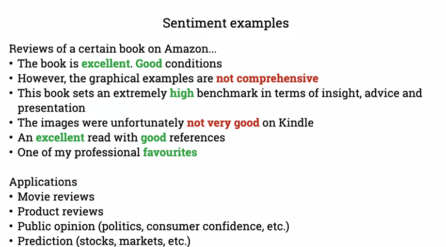

Sentiment is multifaceted.
There are multiple levels of affective states

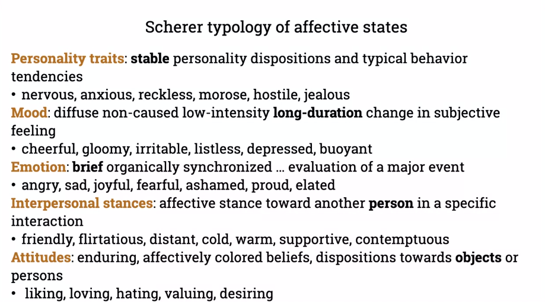

## Basic sentiment classification
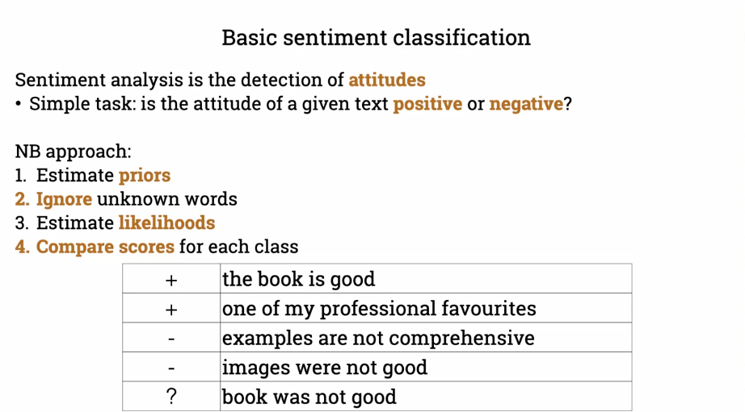

Worked example
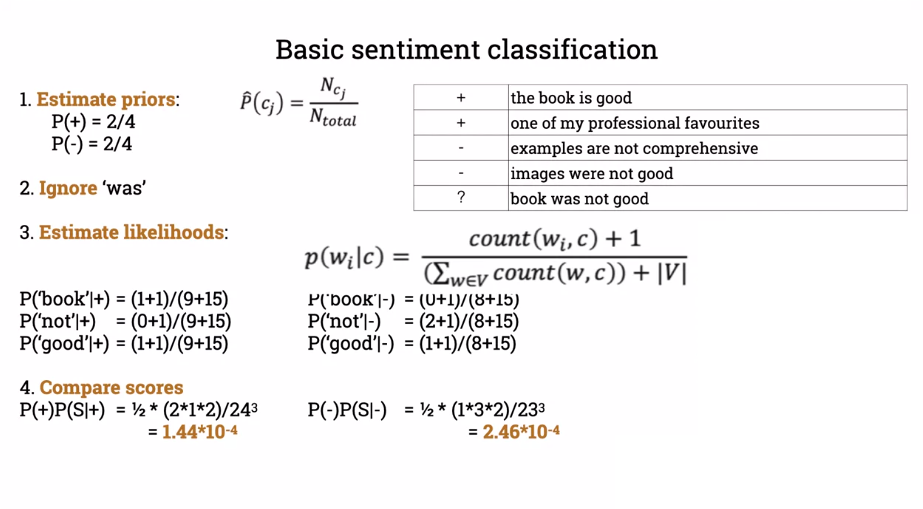

Two optimizations can be made
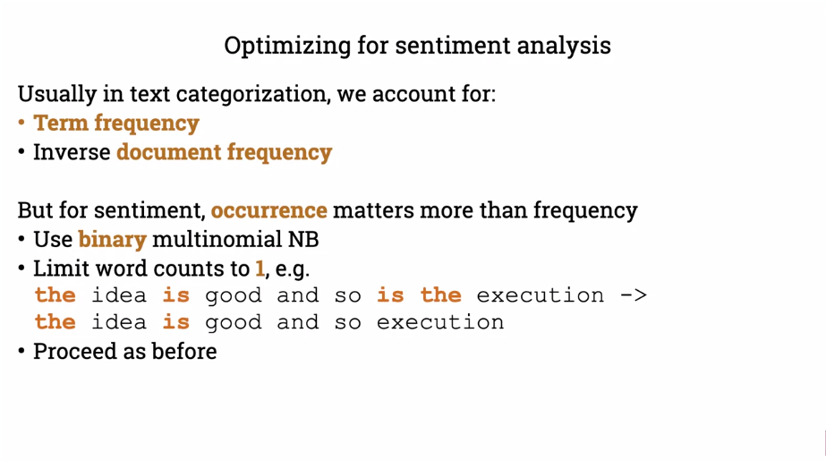

Occurrence is more important than frequency

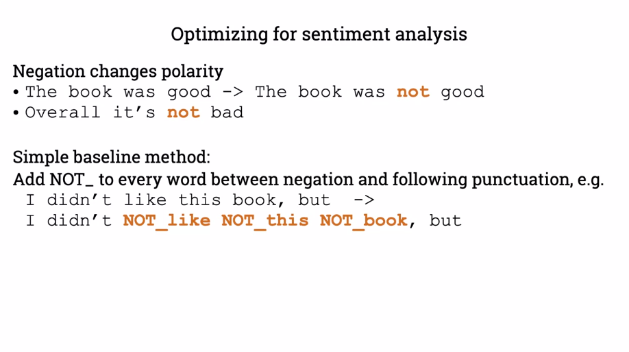
We need to work out the negations

## Sentiment lexicons
When training data is not available or is limited for the goal of building models, we can use sentiment lexicons, which are manually edited word lists.

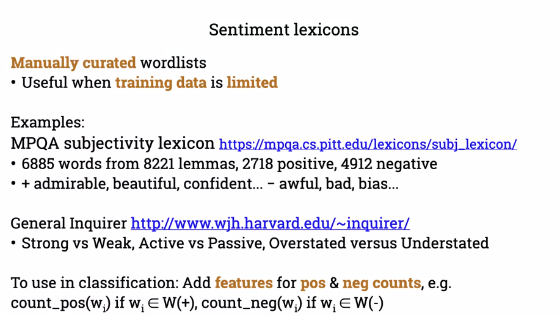

## Summary

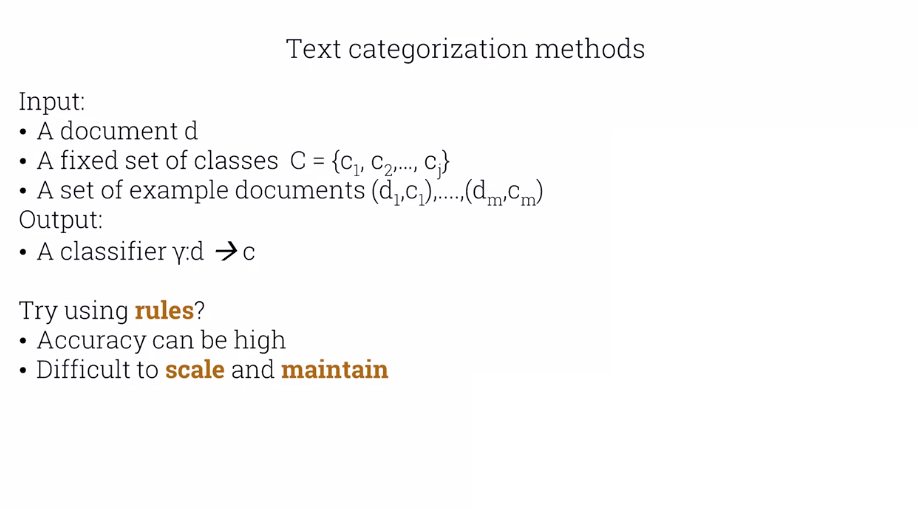
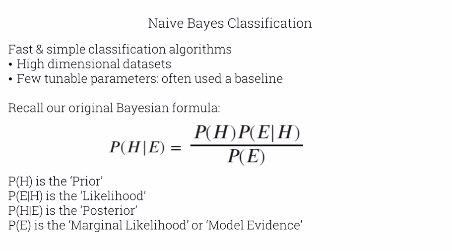
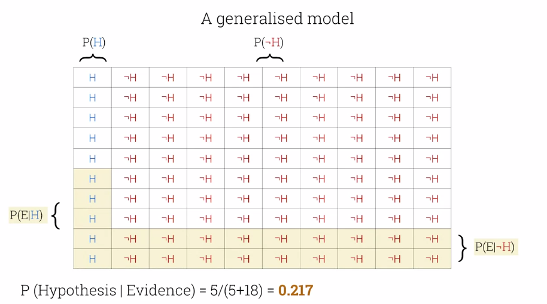
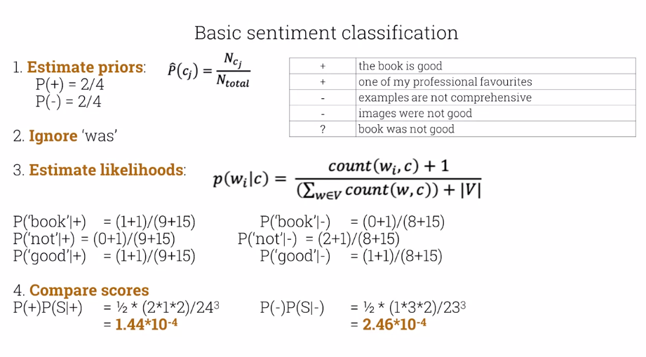
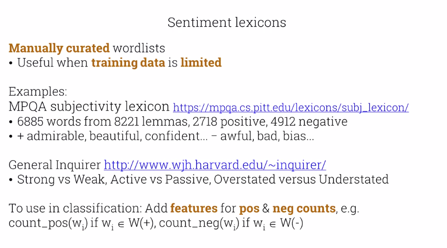
