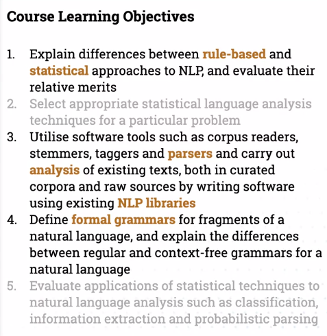
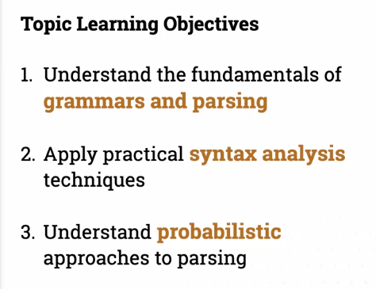
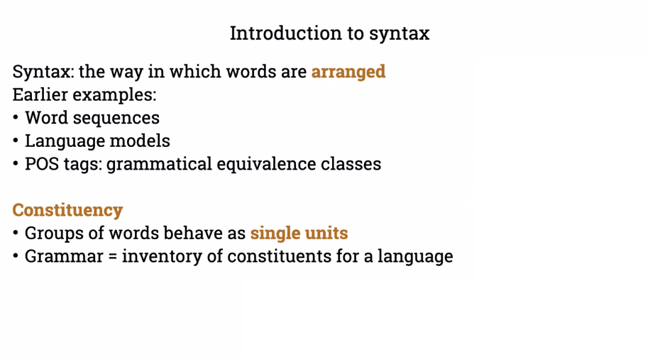
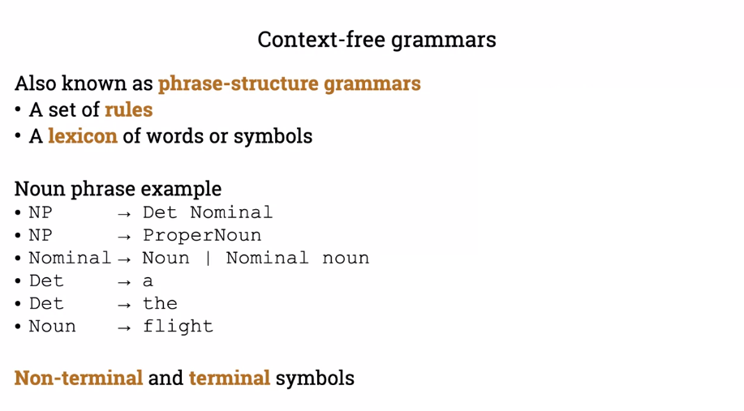
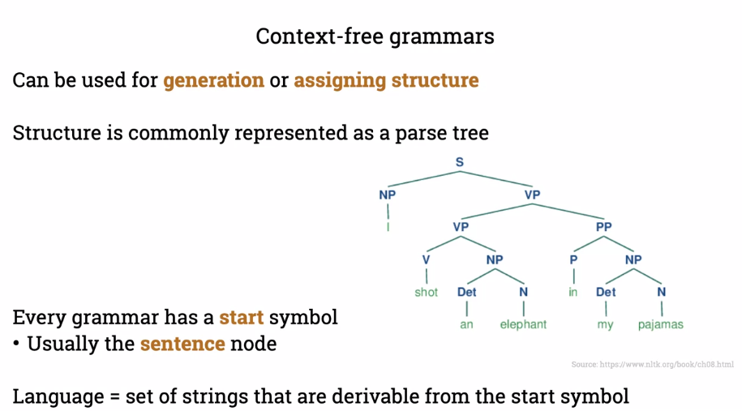
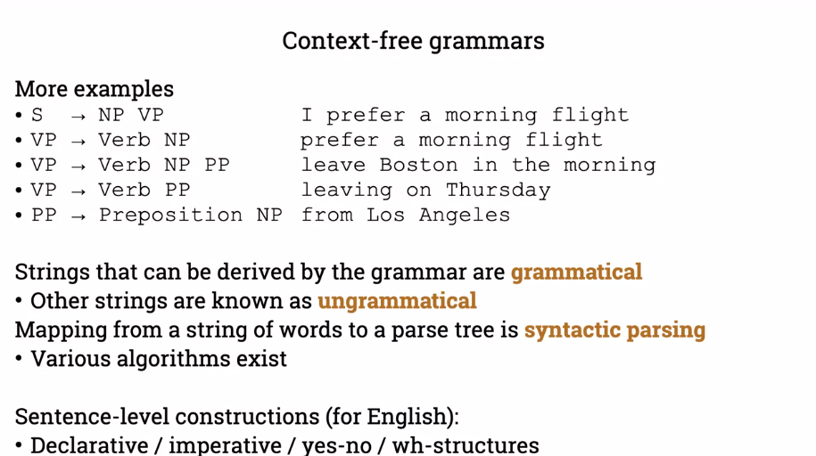
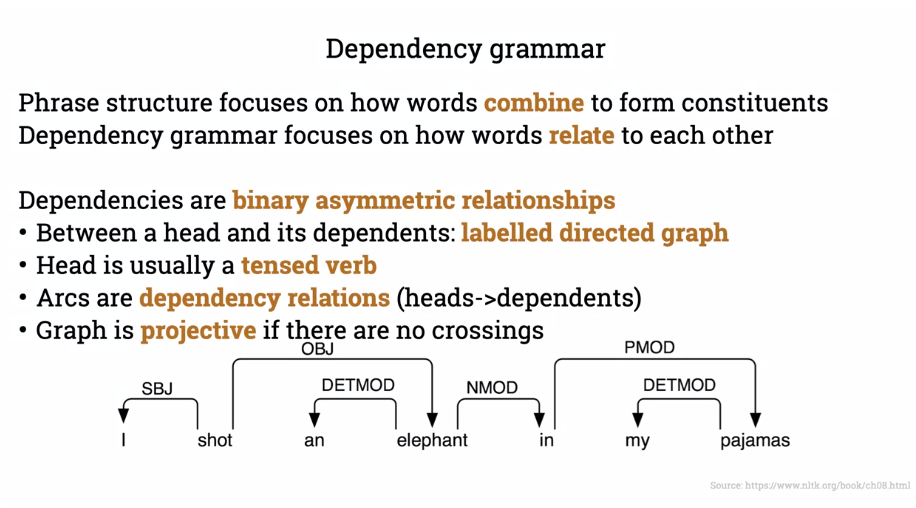

# Syntax and parsing

## Course learning objectives

## Topic learning objectives

# Intro to syntax and parsing

POS (Parts Of Speech) are lexical categories which we attach to words, equivalent to gramatical classes.

## Constituency

Constituents have a common behaviour, in this case, the noun phrases can appear before verbs

## Context-free grammars

The constituents can be formalized.
These are production rules and are composed of **non-terminals** (noun, phrase, det, etc.) and **terminal** symbols (words or symbols in the language)

*Symbol* -> *non-terminals* and/or *terminals*

The rules are used for generation or assigning structure.  
Constituents form higher-level constituents.

Example

Another way of thinking about grammatical structure

