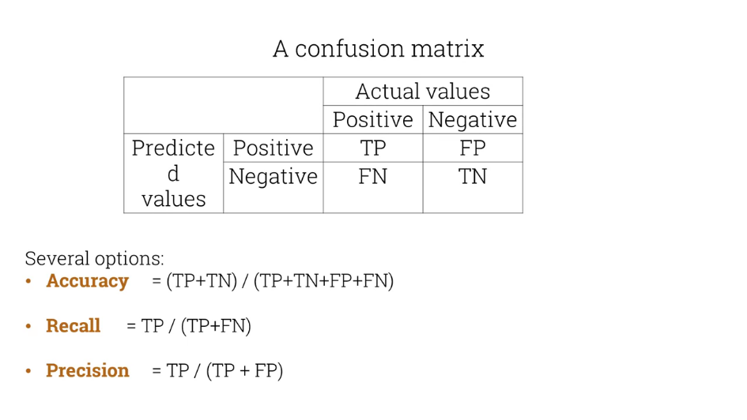
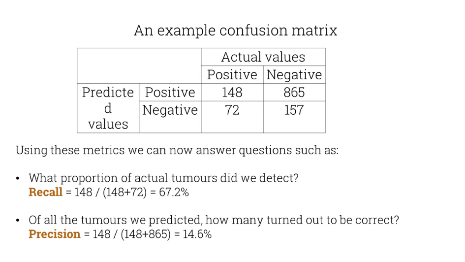

# NLP Platforms and toolkit
We'll be using NLTK, which has its origin in computational linguistics.

## Principles of NLTK
* Simplicity
* Consistency
* Extensibility
* Modularity

NLTK is not necessarily SOTA (State-Of-The-Art) or optimized for runtime performance.

Other toolkits
* Scikit-learn (ML library) A lot of NLP tasks can be modeled as ML tasks.
* Gensim - word embedding, topic modeling for humans
* spaCy - Industrial-strength Natural Language Processing
* Textacy - built on top of spaCy
* TextBlob - Simplified Text Processing built on nltk
* Deep learning: TensorFlow, PyTorch
* Chatbot development: RASA

# Introduction to evaluation

Before we build our system we should think how we're going to **measure its performance**, **how do we know when we have done a good job**?

### In a classification problem
In a spam filter we have a binary problem (yes/no) for whether the message is spam or not.

Accuracy = Correct Predictions / Total Number

This could result in skewed results with unbalanced data, if for example the data already has a majority class which results in high accuracy only by choosing it.

#### Another example classification problem

Predict whether a CT scan shows a tumor or not?

Tumors are rare events, so our classes are unbalanced.
The cost of missing a tumor is much higher than a false positive. **Accuracy is not a good metric**

This is where confusion matrices come into play, this compares predicted values with actual values (ground truth).

Accuracy = (TP + TN) / (TP + TN + FP + FN)
Recall = TP / (TP + FN)
Precission = TP / (TP + FP)

**Recall** and **Precision** are better at illustrating the performance for unbalanced datasets and a baseline against which we can compare the performance of future iterations of our systems with different algorithms or approaches.

