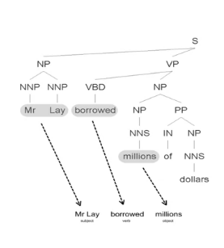

# Processing text data

Polysemy - One words maps to many concepts
Synonymy - One concept maps to many words

Word order is important
> Venetian blind vs blind Venetian

> man bites dog vs dog bites man

Language is generative, there are many ways of expressing the same proposition or assertion.
> Starbucks coffe is my favorite

> The place I like most to feed my caffeine addiction is the company from Seattle with branches everywhere

Language is changing
> I want to buy a mobile

Ill-formed input
> accomodation office

Co-ordination, negation, etc.
> This is not a talk about neuro-linguistic programming

Multi-linguality
> Claudia Schiffer is on the cover of Elle

Sarcasm, irony, slang, jargon, etc.
> That was a wicked lecture

> Yep - the coffee break was the best part

# Text processing fundamentals 1
## Processing text data (normalizing text)

As humans, we process text data effortlessly, don't we?

> DRUNK GETS NINE YEARS IN VIOLIN CASE
> STOLEN PAITING FOUND BY TREE
> RED TAPE HOLDS UP NEW BRIDGE

Language is **ambiguous**.

To determine structure, we must resolve ambiguity. Ambiguity exists at many levels.

**Lexical analysis (tokenization)**
> The cat sat on the map
>
> I can't tokenize this sentence

**Stop word removal**
> The Who, The The, Take That...
>
> To be or not to be (all are stop words)

**Stemming** - We remove endings to get stems.
> fishing, fished, fish, fisher -> fish
>
> argue, argued, argues, arguing -> argu

**Lemmatization** - Linguistically principled analysis
> Passing -> pass + ING
>
> Were -> be + PAST
>
> Delegate = de-leg-ate (?)
>
> Ratify = rat-ify (?)

**Morphology** (prefixes, suffixes, etc.)
> gebäudereinigungsfirmenangestellter -> Gebaude + Reiningung + Firma + Angestellter (bulding + cleaning + company + employee)

**Syntax** - part of speech tagging
* noun, pronoun, adjective, determiner, verb, adverb, preposition, conjunction, and interjection
> book -> NOUN, VERB
> that -> DETERMINER
> flight -> NOUN
> Book that flight -> VERB DET NOUN

Ambiguity problem
> Time flies like an arrow -> NOUN VERB PREP DET NOUN

> Fruit flies like a banana -> ?

> Eat shoots and leaves -> ?

**Parsing** (grammar)
> I saw a venetian blind
>
> I saw a blind venetian
>
> I saw the man on the hill with a telescope
>
> Ruby is a game played by men with odd-shaped balls

**Sentence boundary detection**
> Punctuation denotes the end of a sentence!
> 
> "But not always!", said Fred...
