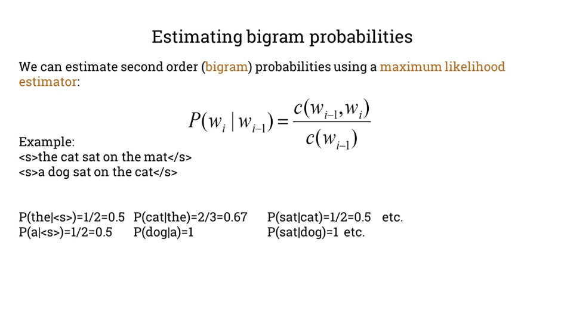
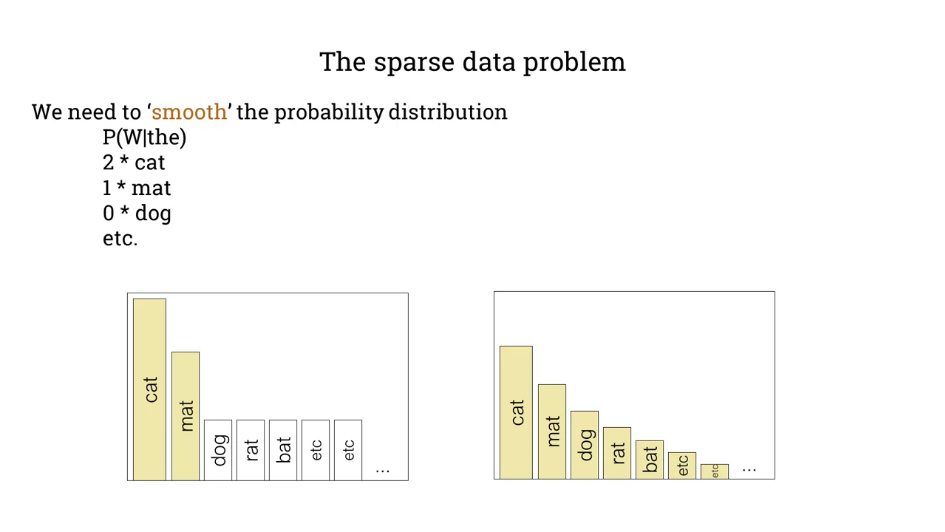
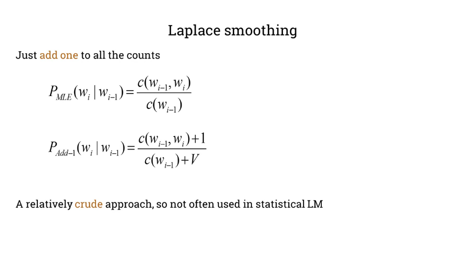
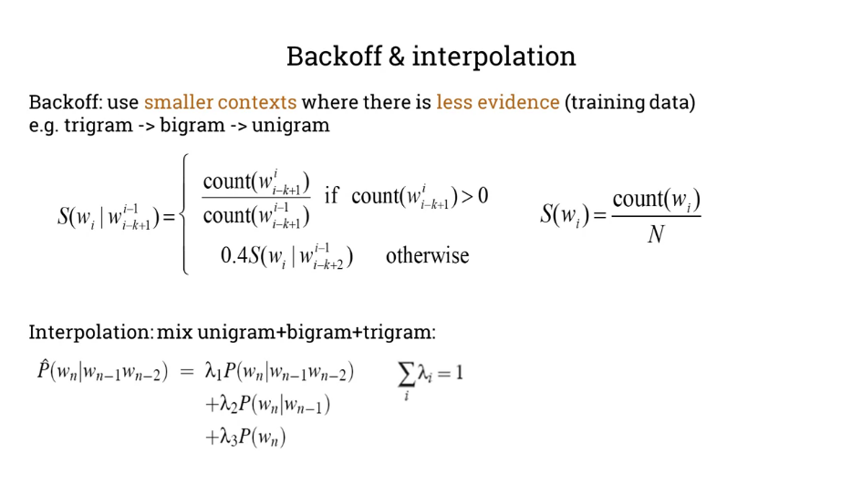
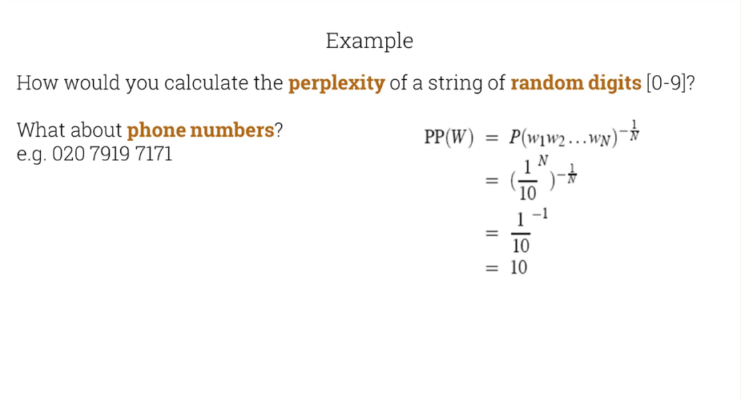
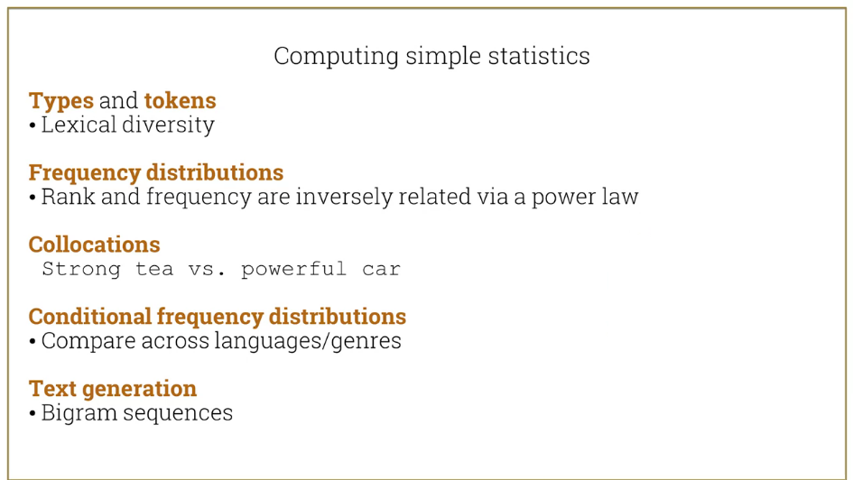
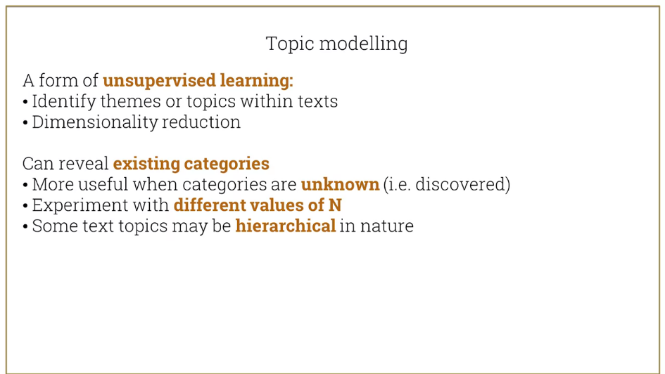

# Language modeling
### Probabilistic language models
How likely is a given sequence of words?

* Machine translation:
> String tea vs Powerful tea

> strong engine vs power engine

* Speech recognition
> I can recognize speech

> I can wreck a nice beach

* Summarization, spelling correction, etc.

Computing probabilities
The probability of a sequence is the joint probability of all the individual words.

P(W) = P(w1, w2, w3, w4, w5 ... Wn)

The probability of an upcoming term given previous words (history)

P(W5|w1, w2, w3, w4)

The chain rule in probability theory:
The probability of a sequence is the multiplication of the probability of all words in the sequence.

P(x1, x2, x3, ..., xn) = P(x1)P(x2|x1)P(x3|x1, x2)...P(xn|x1,...,xn-1)

### Example
e.g. P(mat | the cat sat on the) = count(the cat sat on the mat)/count(the cat sat on the) = 8 / 10 = 0.8

But we **can't estimate all sequences** from **finite training data**

e.g. P(bed | the cat sat on the) = count(the cat sat on the bed)/count(the cat sat on the) = 0 / 10 = 0.0 ?

We see that from the training data, where no occurrence of 'the cat sat on the bed', we get a 0 probability when it should not be.

### A simplifying assumption (Markov condition/assumption)

P(mat | the cat sat on the) = P(mat | the)

OR

P(mat | the cat sat on the) = P(mat | on the) -> The previous 2 words

We limit the context

### Unigrams and bigrams
To make simplify the problem and get non-zero probability results, we calculate the probability of a sequence as the multiplication of all the probabilities of the individual words.

* Simplest case: unigram frequencies

P(w1 w2 ... wn) ≈ Π P(wi)

The probability of the word sequence is the multiplication of all the individual probabilities.

* Using bigrams to predict words

P(wi | w1 w2 ... wi-1) ≈ P(wi | wi-1)

In this case, we use a bigram, meaning we calculate the probability of a word in relation to the previous word.

P(mat | the cat sat on the) ~= P(mat | the)

This is an overestimation.

We have learned:
1. We can calculate the probabilities by counting occurrences
2. Training corpora are finite, so we make simplifying assumptions
3. We can build ngram models using these assumptions

### Estimating bigram probabilities
We can estimate second order (bigram) probabilities using a maximum likelihood estimator:

$$
P(w_i|w_i-1) = \frac{c(w_{i-1}, w_i)}{c(w_{i-1})}
$$

The probability of $w_i$ given $w_{i-1}$ is equal to the count of occurrences of the bigram $(w_{i-1}, w_i)$ divided by the count of the word $w_{i-1}$

When the test data has new words, we can use smoothing.

Laplace smoothing - Just add one to all the counts

However, it's not used very much because of its impression.

We have other smoothing techniques called Backoff and interpolation

Interpolation uses lambdas which all add up to 1. They multiply the probability of the ngrams, usually trigram, bigram, unigrams.

# Evalutating language models
Our LM should prefer likely sequences over unlikely ones
* We **train** our model using **training** data
* We then **test** it using some **unseen** data

Two approaches to evaluation:
* Extrinsic - use in a real app (e.g. speech recognition), measure performance (e.g. accuracy)
* Intrinsic - use perplexity

Perplexity is analogous to randomness or the branching factor, e.g.
> The cat sat on the _?
> I saw a _?

### Perplexity
Perplexity is the inverse probability of the test set, normalized by the number of words.

$$
PP(W) = P(w_1w_2...w_N)^\dfrac{-1}{N}
$$

The -1 translates to the reciprocal and the N denominator to the Nth root

$$
PP(W) = \sqrt[N]{\frac{1}{P(w_1w_2...w_N)}}
$$

Then by the chain rule, the probability of the sequence is equal to the probability of the individual condition probabilities of the n-grams within the sequence.
$$
PP(W) = \sqrt[N]{\prod_{i=1}^{N}\frac{1}{P(w_i|w_1...w_{i-1})}}
$$

High probability ~= low perplexity

# Topic modeling
Topics are an abstract representation of the way the documents in a collection are grouped together.

# Summary

