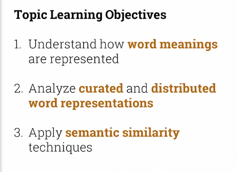
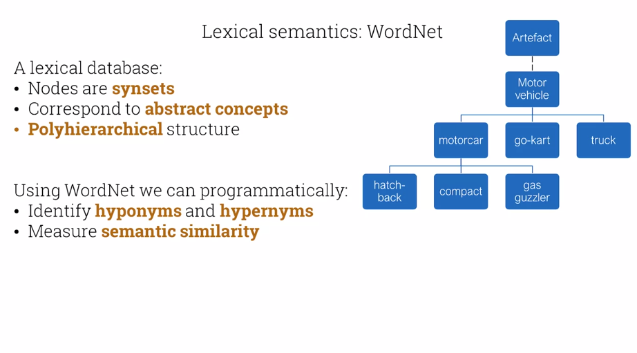
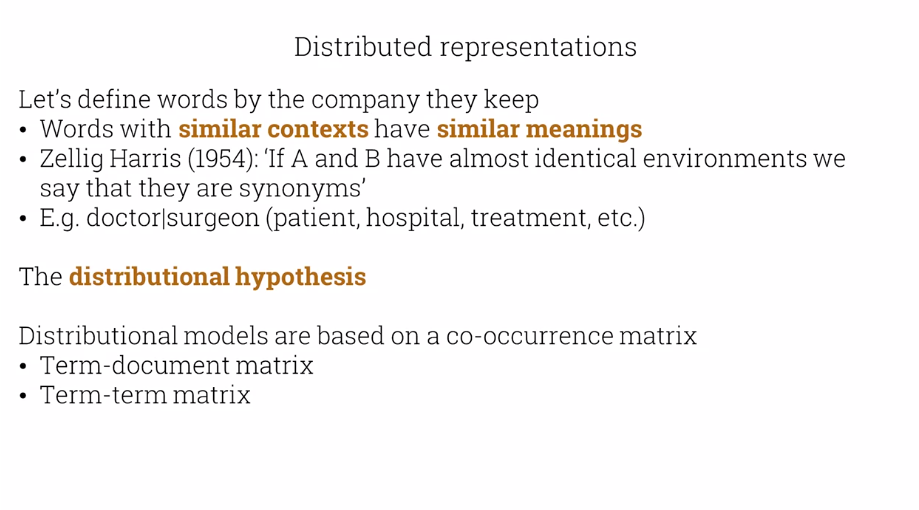
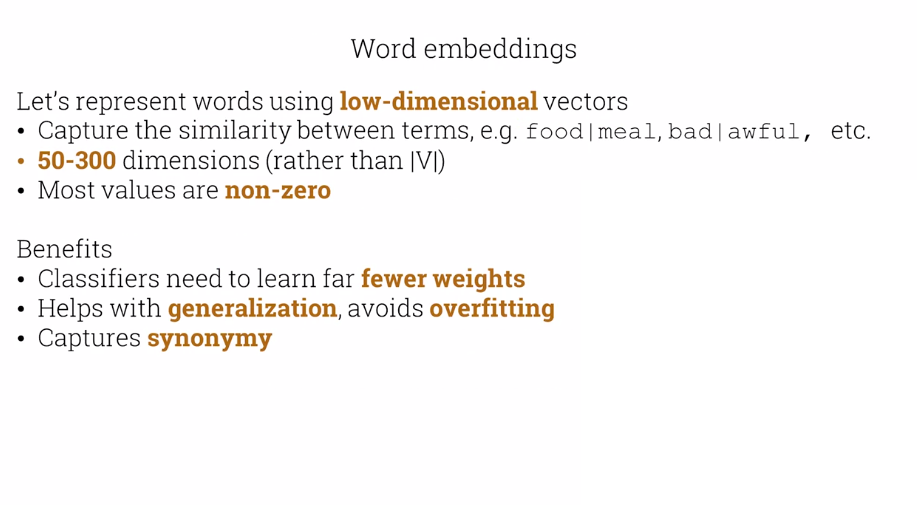

# Vector semantics and embeddings

WordNet has the shortcoming of being manually maintained and requiring a lot of human effort to update it.

Let's define words by the company they keep
* Words with **similar contexts** have **similar meanings**. Also referred to as the **distributional hypothesis**.

* >If A and B have almost identical environments, we say that they are synonyms

* E.g. doctor|surgeon (patient, hospital, treatment, etc.)

## The distributional hypothesis
Distributional models are based on a co-occurrence matrix
* Term-document matrix
* Term-term matrix

### Term document matrix

| | As you like it | Twelfth night | Julius Caesar | Henry V |
|---|---|---|---|---|
|battle|1|0|7|13|
|good|114|80|62|89|
|fool|36|58|1|4|
|wit|20|15|2|3|

Overall matrix is |V| by |D|

**Similar documents** have **similar words**:
* Represented by the **column vectors**

**Similar words** occur in **similar documents**:
* Represented by the **row vectors**

### Term-term matrix

| | computer | data | result | pie | sugar |
|---|---|---|---|---|---|
|cherry| 2 | 8 | 9 | 442 | 25 |
|strawberry | 0 | 0 | 1 | 60 | 19 |
|digital | 1670 | 1683 | 85 | 5 | 4 |
|information | 3325 | 3982 | 378 | 5 | 13 |

Term-term matrices are **sparse**
* Term vectors are **long** |V|
* Most entries are **zero**

Doesn't reflect underlying linguistic structure:
`food is bad` and `meal was aweful`

## Word embeddings

Let's represent words using **low-dimensional** vectors
* Capture the similarity between terms, e.g. `food|meal, bad|awful`, etc.
* **50-300** dimensions (rather than |V|)
* Most values are non-zero

Benefits
* Classifiers need to learn far **fewer weights**
* Helps with **generalization**, avoids **overfitting**
* Captures **synonymy**

## Word2vec
Word2vec software package
* **Static** embeddings (unlike BERT or ELMo)

Key idea:
* **Predict** rather than count
* **Binary prediction task** "Is word x likely to co-occur with word y?"
* Keep **classifier weights**
* Running text is the training data

Basic algorithm (skip-gram with negative sampling)
1. Treat neighboring context words as **positive** samples
2. Treat other random words in V as **negative** samples
3. Train a **logistic regression classifier** to distinguish these classes
4. Use **learned weights** as **embeddings**

## Training the classifier
**Iterate** thru training data, e.g.  
`The cat sat on the mat`

Generate **positive** samples, e.g. +/- 2 words, 'sat'  
(sat, cat), (sat, The), (sat, on), (sat, the)

Generate **k negative** samples, e.g.  
(sat, trumpet), (sat, nice), (sat, explode), (sat, if),...

We want to **maximize** similarity of (w, cpos) pairs, **minimize** similarity of (w, cneg) pairs.

Starting with **random** vectors, use **stochastic gradient descent** to:
* **maximize** dot product of word with **actual** context words
* **minimize** dot product of word with **negative** non-context words

Outputs: **target** matrix W, **context** matrix C  
Embedding for word i = Wi + Ci

## Other static embeddings
fasttext:
* deals with **unknown** words and **sparsity** by using **subword models**
* E.g. characters ngrams
* Embedding for a given word is **sum** of all embeddings

GloVe
* Uses **global** corpus statistics
* Combines **count-based** models with word2vec **linear** structures

